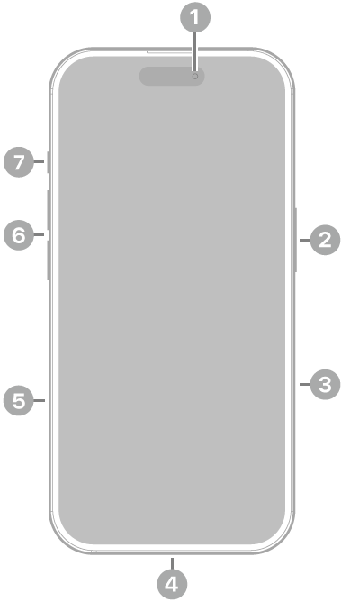

# Phone 16 - Especificaciones técnicas

## Año de presentación: 2024

## Acabado
- Negro
- Blanco
- Rosa
- Verde azulado
- Azul ultramar

Diseño de aluminio, parte delantera con *Ceramic Shield* de última generación, parte trasera de vidrio tintado en masa (negro, rosa, verde azulado y azul ultramar).

## Capacidad
- 128 GB
- 256 GB
- 512 GB

## Dimensiones y peso
- **Ancho:** 7,16 cm
- **Alto:** 14,76 cm
- **Grosor:** 0,78 cm
- **Peso:** 170 g

## Pantalla
- **Pantalla Super Retina XDR**
- Pantalla OLED de 6,1 pulgadas (15,54 cm) en diagonal
- Resolución de 2.556 por 1.179 píxeles a 460 p/p
- *Dynamic Island*
- Pantalla HDR
- *True Tone*
- Gama cromática amplia (P3)
- Respuesta háptica
- Contraste de 2.000.000:1 (típico)
- Brillo máximo de 1.000 nits (típico), pico de brillo de 1.600 nits (HDR), pico de brillo de 2.000 nits (en exteriores) y brillo mínimo de 1 nit
- Cubierta oleófuga antihuellas
- Compatible con la presentación simultánea de múltiples idiomas y grupos de caracteres

> La pantalla del iPhone 16 tiene esquinas redondeadas que rematan el diseño curvo del dispositivo, y esas esquinas se encuentran dentro de un rectángulo estándar. Si se mide como un rectángulo estándar en diagonal, la pantalla tiene 6,12 pulgadas. La superficie real de visión es inferior.

## Resistencia a las salpicaduras, el agua y el polvo³
**Calificación IP68** según la norma IEC 60529 (hasta 6 metros de profundidad durante un máximo de 30 minutos).

## Chip
- **Chip A18**
- Nueva CPU de 6 núcleos (2 de rendimiento y 4 de eficiencia)
- Nueva GPU de 5 núcleos
- Nuevo *Neural Engine* de 16 núcleos

## Cámara
### Sistema avanzado de cámara dual
- **Cámara Fusion de 48 Mpx**: 26 mm, apertura de ƒ/1,6, estabilización óptica de imagen por desplazamiento del sensor, 100% *Focus Pixels* y compatibilidad con fotos de superalta resolución (24 y 48 Mpx)
- **Teleobjetivo x2 de 12 Mpx**: 48 mm, apertura de ƒ/1,78, estabilización óptica de imagen por desplazamiento del sensor de segunda generación y 100% *Focus Pixels*
- **Ultra gran angular de 12 Mpx**: 13 mm, apertura de ƒ/2,2 y campo de visión de 120° y 100% *Focus Pixels*
- Zoom óptico de acercamiento x2, zoom óptico de alejamiento x2 y rango de zoom óptico x4
- Zoom digital hasta x10
- Control de Cámara
- Cubierta de la lente de cristal de zafiro
- Flash *True Tone*
- *Photonic Engine*
- *Deep Fusion*
- HDR Inteligente 5
- Retratos de última generación con Control de Profundidad y Enfoque
- Iluminación de Retratos con seis efectos
- Modo Noche
- Fotos panorámicas (hasta 63 Mpx)
- Estilos Fotográficos de última generación
- Fotos espaciales
- Fotografía macro
- Gama cromática amplia para fotos y Live Photos
- Corrección del objetivo (ultra gran angular)
- Corrección avanzada de ojos rojos
- Estabilización automática de imagen
- Modo ráfaga
- Geoetiquetado de fotos
- Captura de imagen en formato HEIF y JPEG

### Grabación de vídeo

- Grabación de vídeo en 4K a 24, 25, 30 o 60 f/s con Dolby Vision
- Grabación de vídeo en 1080p a 25, 30 o 60 f/s con Dolby Vision
- Grabación de vídeo en 720p a 30 f/s con Dolby Vision
- Modo Cine hasta 4K HDR a 30 f/s
- Modo Acción hasta 2,8K a 60 f/s
- Grabación de vídeo macro, a cámara lenta y en time‑lapse
- Vídeo a cámara lenta en 1080p a 120 o 240 f/s
- Grabación de vídeo espacial en 1080p a 30 f/s
- Vídeo en time‑lapse con estabilización
- Time-lapse con modo Noche
- Vídeo QuickTake hasta 4K a 60 f/s con Dolby Vision
- Estabilización óptica de imagen por desplazamiento del sensor para vídeo (cámara Fusion)
- Zoom digital hasta x6
- Zoom de audio
- Flash True Tone
- Estabilización de vídeo con calidad de cine (4K, 1080p y 720p)
- Enfoque automático continuo
- Opción de sacar fotos de 8 Mpx durante la grabación de vídeo en 4K
- Reproducción con zoom
- Grabación de vídeo en formato HEVC y H.264
- Audio espacial y grabación en estéreo
- Reducción de ruido del viento
- Mezcla de Audio

### Cámara TrueDepth

- Cámara de 12 Mpx
- Apertura de ƒ/1,9
- Enfoque automático con Focus Pixels
- Retina Flash
- Photonic Engine
- Deep Fusion
- HDR Inteligente 5
- Retratos de última generación con Control de Profundidad y Enfoque
- Iluminación de Retratos con seis efectos
- Animoji y Memoji
- Modo Noche
- Estilos Fotográficos de última generación
- Gama cromática amplia para fotos y Live Photos
- Corrección del objetivo
- Estabilización automática de imagen
- Modo ráfaga
- Grabación de vídeo en 4K a 24, 25, 30 o 60 f/s con Dolby Vision
- Grabación de vídeo en 1080p a 25, 30 o 60 f/s con Dolby Vision
- Modo Cine hasta 4K a 30 f/s con Dolby Vision
- Vídeo a cámara lenta en 1080p a 120 f/s
- Vídeo en time‑lapse con estabilización
- Time-lapse con modo Noche
- Vídeo QuickTake hasta 4K a 60 f/s con Dolby Vision
- Estabilización de vídeo con calidad de cine (4K, 1080p y 720p)
- Audio espacial y grabación en estéreo

### Face ID

- Reconocimiento facial mediante la cámara TrueDepth

### Apple Pay

- Usa Face ID para pagar en tiendas, apps y páginas web con tu iPhone
- Confirma las compras realizadas con Apple Pay en el Mac

## Seguridad

- Emergencia SOS vía satélite
- Detección de accidentes

## Redes móviles e inalámbricas

### Modelo A3287 / Modelo A3290

- **FDD-5G NR**: n1, n2, n3, n5, n7, n8, n12, n20, n25, n26, n28, n30, n66, n70, n75, n76
- **TDD-5G NR**: n38, n40, n41, n48, n53, n77, n78, n79
- **FDD-LTE**: 1, 2, 3, 4, 5, 7, 8, 12, 13, 17, 18, 19, 20, 25, 26, 28, 30, 32, 66
- **TDD-LTE**: 34, 38, 39, 40, 41, 42, 48, 53
- **UMTS/HSPA+/DC‑HSDPA**: 850, 900, 1.700/2.100, 1.900, 2.100 MHz
- **GSM/EDGE**: 850, 900, 1.800, 1.900 MHz

### Todos los modelos

- 5G (sub‑6 GHz) con MIMO 4x4
- LTE Gigabit con MIMO 4x4 y LAA
- Wi‑Fi 7 con MIMO 2x2
- Bluetooth 5.3
- Chip de banda ultraancha de segunda generación
- Tecnología de red Thread
- NFC con modo de lectura
- Tarjetas exprés con reserva de batería

## Geolocalización

- GPS, GLONASS, Galileo, QZSS y BeiDou
- Brújula digital
- Wifi
- Redes móviles
- Microlocalización iBeacon

## Videollamadas

- Videollamadas FaceTime vía wifi o red móvil
- Videollamadas FaceTime HD (1080p) vía wifi o redes 5G
- SharePlay en llamadas FaceTime para disfrutar de películas, series, música y apps en compañía
- Pantalla compartida
- Modo Retrato en videollamadas FaceTime
- Audio espacial
- Modos de micrófono Aislamiento de Voz y Sonido de Fondo
- Zoom en la cámara trasera

## Llamadas de voz

- Llamadas de voz FaceTime
- Voz por LTE (VoLTE)
- Llamadas vía wifi
- SharePlay en llamadas FaceTime para disfrutar de películas, series, música y apps en compañía
- Pantalla compartida
- Audio espacial
- Modos de micrófono Aislamiento de Voz y Sonido de Fondo

## Reproducción de audio

- Formatos compatibles: AAC, APAC, MP3, Apple Lossless, FLAC, Dolby Digital, Dolby Digital Plus, Dolby Atmos
- Audio espacial
- Límite de volumen configurable por el usuario

## Reproducción de vídeo

- Formatos compatibles: HEVC, H.264, AV1
- HDR con Dolby Vision, HDR10+/HDR10 y HLG
- AirPlay hasta 4K HDR para duplicación de pantalla y salida de fotos y vídeo a través del Apple TV o televisor inteligente
- Compatibilidad con vídeo en espejo y salida de vídeo hasta 4K HDR mediante DisplayPort USB-C o adaptador USB-C a AV digital (se vende por separado)

## Siri

- Agiliza las tareas como mandar mensajes, poner recordatorios y más
- Actívalo con "Oye Siri" o simplemente "Siri"
- Mayor privacidad en un asistente inteligente

## Botones y conectores externos

1. **Cámara delantera**
2. **Botón lateral**
3. **Control de la cámara**
4. **Conector USB-C**
5. **Bandeja de la tarjeta SIM** *(disponible en modelos comprados fuera de Estados Unidos)**
6. **Botones de volumen**
7. **Botón Acción**
8. **Cámaras traseras**
9. **Flash**

### Prestaciones del botón Acción
- Modo Silencio, Modos de Concentración, Cámara, Linterna, Notas de Voz, Reconocer Música, Traducir, Lupa, Controles, Atajos o Accesibilidad

### Prestaciones de Control de Cámara
- Exposición, Profundidad, Zoom, Cámaras, Estilos y Tono

## Carga y ampliación

- **Conector USB-C compatible con:**
  - Carga
  - DisplayPort
  - USB 2 (hasta 480 Mb/s)

## Batería y alimentación

- **Reproducción de vídeo:** Hasta 22 horas
- **Streaming de vídeo:** Hasta 18 horas
- **Reproducción de audio:** Hasta 80 hora
- **Batería recargable integrada de iones de litio**
- **Carga inalámbrica con MagSafe** de hasta 25 W con adaptador de 30 W o superior
- **Carga inalámbrica con cargadores Qi** de hasta 7,5 W
- **Carga rápida:** Hasta un 50 % en unos 30 minutos con un adaptador de 20 W o superior y cable de carga USB-C o con un adaptador de 30 W o superior y cargador MagSafe *(todos se venden por separado)*

## MagSafe

- Carga inalámbrica de hasta 25 W con un adaptador de 30 W o superior
- Conjunto de imanes
- Imán de alineación
- Identificación de accesorios con NFC
- Magnetómetro

## Sensores

- Face ID
- Barómetro
- Giroscopio de alto rango dinámico
- Acelerómetro de fuerza g alta
- Sensor de proximidad
- Doble sensor de luz ambiental

## Sistema operativo

iOS es el sistema operativo móvil más personal y seguro del mundo. Está repleto de funciones avanzadas y se ha diseñado para proteger tu privacidad.

[Descubrir las novedades de iOS](#)

[Manual de uso del iPhone](#)

## Accesibilidad

Las prestaciones integradas para distintas necesidades visuales, motrices, auditivas, cognitivas y del habla te ayudan a sacar todo el partido a tu iPhone de la forma que mejor se adapte a ti.

[Obtén más información sobre Accesibilidad](#)

### Prestaciones incluidas:

- VoiceOver
- Zoom
- Lupa
- Control por Voz
- Control por Botón
- AssistiveTouch
- Seguimiento Ocular
- Compatibilidad con RTT y TTY
- Subtítulos Opcionales
- Voz Personal
- Subtítulos en Vivo
- Voz en Tiempo Real
- Escribir a Siri
- Atajos de Voz
- Contenido Leído

## Apps integradas

- Apple Store
- App Store
- Libros
- Calculadora
- Calendario
- Cámara
- Clips
- Reloj
- Brújula
- Contactos
- FaceTime
- Archivos
- Buscar
- Fitness
- Freeform
- GarageBand
- Salud
- Casa
- iMovie
- iTunes Store
- Keynote
- Lupa
- Mail
- Mapas
- Medidas
- Mensajes
- Música
- Notas
- Numbers
- Pages
- Contraseñas
- Teléfono
- Fotos
- Podcasts
- Recordatorios
- Safari
- Ajustes
- Atajos
- Bolsa
- Consejos
- Traducir
- TV
- Notas de Voz
- Cartera
- Watch
- Tiempo

[Puedes ver la lista completa de apps de Apple disponibles en el iPhone](https://www.apple.com/es/apps)

## Tarjeta SIM

- **Doble SIM (Nano SIM y eSIM)**
- **Compatible con doble eSIM**

[Más información sobre la eSIM](#)
[Más información sobre la eSIM en viajes al extranjero](#)

## Clasificación de compatibilidad con audífonos

- Compatible con la prestación Audífono

## Compatibilidad con adjuntos de Mail

### Tipos de documento visibles

- `.jpg`, `.tiff`, `.gif` *(imágenes)*
- `.doc`, `.docx` *(Microsoft Word)*
- `.htm`, `.html` *(páginas web)*
- `.key` *(Keynote)*
- `.numbers` *(Numbers)*
- `.pages` *(Pages)*
- `.pdf` *(Vista Previa y Adobe Acrobat)*
- `.ppt`, `.pptx` *(Microsoft PowerPoint)*
- `.txt` *(texto)*
- `.rtf` *(formato de texto enriquecido)*
- `.vcf` *(información de contacto)*
- `.xls`, `.xlsx` *(Microsoft Excel)*
- `.zip`
- `.ics`, `.usdz` *(USDZ Universal)*

## Requisitos del sistema

- **Cuenta de Apple** *(para algunas prestaciones)*
- **Acceso a internet**
- **La sincronización con un Mac o PC requiere:**
  - macOS Catalina 10.15 o posterior con el Finder
  - De macOS High Sierra 10.13 a macOS Mojave 10.14.6 con iTunes 12.8 o posterior
  - Windows 10 o posterior con iTunes 12.12.10 o posterior *(descarga gratuita desde [apple.com](https://www.apple.com/es/itunes/download))*

## Requisitos ambientales

- **Temperatura de funcionamiento:** 0 a 35 °C
- **Temperatura de almacenamiento:** -20 a 45 °C
- **Humedad relativa:** 5 % - 95 % sin condensación
- **Altitud máxima de funcionamiento:** probado hasta 3.000 m

# Idiomas

## Idiomas compatibles

- Alemán 
- Árabe 
- Búlgaro 
- Catalán 
- Checo 
- Chino (simplificado, tradicional y de Hong Kong) 
- Coreano 
- Croata 
- Danés
- Eslovaco 
- Español (de España y Latinoamérica)
- Finés
- Francés (de Canadá y Francia)
- Griego
- Hebreo 
- Hindi
- Húngaro
- Indonesio 
- Inglés (de Australia, Estados Unidos y Reino Unido) 
- Italiano 
- Japonés 
- Kazajo 
- Malayo 
- Neerlandés 
- Noruego 
- Polaco 
- Portugués (de Brasil y Portugal) 
- Rumano 
- Ruso 
- Sueco 
- Tailandés 
- Turco 
- Ucraniano 
- Vietnamita 

##Idiomas Compatibles con Teclado QuickType
- Ainu
- Akan
- Albanés
- Alemán (de Alemania, Austria y Suiza)
- Amárico
- Apache (occidental)
- Árabe
- Árabe (najdí)
- Armenio
- Asamés
- Asirio
- Azerí
- Bengalí (alfabético, InScript y transliteración)
- Bielorruso
- Birmano
- Bodo
- Búlgaro
- Butanés
- Cabilio
- Cachemir (árabe y devanagari)
- Canarés (InScript, QWERTY y transliteración)
- Cantonés tradicional (cangjie, fonético, manual, sucheng y wubihua)
- Catalán
- Checo
- Cheroqui
- Chickasaw
- Chino simplificado (manual, pinyin de 10 teclas, pinyin QWERTY, shuangpin y wubihua)
- Chino tradicional (cangjie, manual, pinyin de 10 teclas, pinyin QWERTY, shuangpin, sucheng, wubihua y zhuyin)
- Choctaw
- Chuvasio
- Cingalés
- Coreano (estándar y de 10 teclas)
- Croata
- Danés
- Divehi
- Dogri
- Emoji
- Eslovaco
- Esloveno
- Español (de España, Latinoamérica y México)
- Estonio
- Feroés
- Filipino
- Finés
- Flamenco
- Francés (de Bélgica, Canadá, Francia y Suiza)
- Fula (adlam)
- Gaélico irlandés
- Galés
- Georgiano
- Griego
- Gujarati (alfabético, InScript y transliteración)
- Hausa
- Hawaiano
- Hebreo
- Hindi (alfabético, InScript y transliteración)
- Hmong (pahawh)
- Húngaro
- Igbo
- Italiano
- Indonesio
- Inglés (de Australia, Canadá, EE. UU., Inda, Japón, Nueva Zelanda, Reino Unido, Singapur y Sudáfrica)
- Ingusetio
- Islandés
- Japonés (kana y romaji)
- Jemer
- Kazajo
- Kirguís
- Konkaní (devanagari)
- Kurdo (árabe, latino)
- Laosiano
- Letón
- Lituano
- Lushootseed
- Macedonio
- Maithili
- Malayalam (alfabético, InScript y transliteración)
- Malayo (árabe, latino)
- Maltés
- Mandeo
- Manipurí (bengalí y alfabeto meetei)
- Maorí
- Maratí (InScript, QWERTY y transliteración)
- Maskoki
- Micmac
- Mongol
- N'Ko
- Navajo
- Neerlandés
- Nepalí
- Noruego (bokmål, nynorsk)
- Oriya (alfabético e InScript)
- Osage
- Pastún
- Persa
- Persa (de Afganistán)
- Polaco
- Portugués (de Brasil y Portugal)
- Punyabí (alfabético, InScript, QWERTY y transliteración)
- Rejang
- Rohinyá
- Rumano
- Ruso
- Sami inari
- Sami kildin
- Sami lule
- Sami meridional
- Sami pite
- Sami septentrional
- Sami skolt
- Sami ume
- Samoano
- Sánscrito
- Santali (devanagari y alfabeto Ol Chiki)
- Serbio (cirílico y latino)
- Sindi (árabe y devanagari)
- Suajili
- Sueco
- Tailandés
- Tamazight (marroquí estándar)
- Tamil (anjal, tamil 99 y transliteración)
- Tayico
- Telugu (alfabético, InScript, QWERTY y transliteración)
- Tibetano
- Tongano
- Turco
- Turcomano
- Ucraniano
- Uigur
- Urdú (alfabético, QWERTY y transliteración)
- Uzbeko (árabe, cirílico y latino)
- Vietnamita (télex, VIQR y VNI)
- Wancho
- Wolastoqey
- Yi de Liangshan
- Yidis
- Yoruba

## Idiomas compatibles con el teclado QuickType y el autocorrector
- Alemán (de Alemania, Austria y Suiza)
- Árabe
- Árabe (najdí)
- Bengalí (alfabético, InScript y transliteración)
- Búlgaro
- Catalán
- Checo
- Cheroqui
- Chino simplificado (Pinyin QWERTY)
- Chino tradicional (estándar y zhuyin)
- Chino tradicional (Pinyin QWERTY)
- Coreano (estándar y de 10 teclas)
- Croata
- Danés
- Eslovaco
- Esloveno
- Español (de España, Latinoamérica y México)
- Estonio
- Filipino
- Finés
- Francés (de Bélgica, Canadá y Suiza)
- Gaélico irlandés
- Griego
- Gujarati (alfabético, InScript y transliteración)
- Hawaiano
- Hebreo
- Hindi (alfabético, InScript y transliteración)
- Húngaro
- Indonesio
- Inglés (de Australia, Canadá, EE. UU., India, Japón, Nueva Zelanda, Reino Unido, Singapur y Sudáfrica)
- Islandés
- Italiano
- Japonés (kana y romaji)
- Letonio
- Lituano
- Macedonio
- Malayo
- Maratí (alfabético, InScript y transliteración)
- Neerlandés (de Bélgica)
- Neerlandés
- Noruego (bokmål y nynorsk)
- Persa
- Persa (de Afganistán)
- Polaco
- Portugués (de Brasil y Portugal)
- Punyabí (alfabético, InScript, QWERTY y transliteración)
- Rumano
- Ruso
- Serbio (cirílico y latino)
- Sueco
- Tailandés
- Tamil (alfabético, anjal, tamil 99 y transliteración)
- Telugu
- Turco
- Ucraniano
- Urdu (alfabético, QWERTY y transliteración)
- Vietnamita (télex)

## Idiomas compatibles con el teclado QuickType y la escritura predictiva
- Alemán (de Alemania, Austria y Suiza)
- Árabe
- Árabe (najdí)
- Bengalí
- Cantonés (tradicional)
- Checo
- Chino (simplificado y tradicional)
- Coreano
- Danés
- Esloveno
- Español (de España, Latinoamérica y México)
- Francés (de Bélgica, Canadá, Francia y Suiza)
- Griego
- Gujarati
- Hebreo
- Hindi
- Indonesio
- Inglés (de Australia, Canadá, EE. UU., India, Japón, Reino Unido, Singapur y Sudáfrica)
- Islandés
- Italiano
- Japonés
- Lituano
- Maratí
- Neerlandés (de Bélgica y Países Bajos)
- Noruego (bokmål, nynorsk)
- Polaco
- Portugués (de Brasil y Portugal)
- Punyabí
- Rumano
- Ruso
- Sueco
- Tailandés
- Tamil
- Telugu
- Turco
- Vietnamita

## Idiomas compatibles con el teclado QuickType y la escritura multilingüe
- Alemán (de Alemania, Austria y Suiza)
- Chino simplificado (pinyin)
- Chino tradicional (pinyin)
- Español (de España, Latinoamérica y México)
- Francés (de Bélgica, Canadá, Francia y Suiza)
- Hindi (latino)
- Inglés (de Australia, Canadá, Estados Unidos, India, Japón, Nueva Zelanda, Reino Unido, Singapur y Sudáfrica)
- Italiano
- Japonés (romaji)
- Neerlandés (de Bélgica y Países Bajos)
- Polaco
- Portugués (de Brasil y Portugal)
- Rumano
- Turco
- Vietnamita

## Idiomas compatibles con el teclado QuickType y las sugerencias contextuales
- Alemán (de Alemania, Austria y Suiza)
- Árabe
- Árabe (najdí)
- Chino (simplificado)
- Español (de España, Latinoamérica y México)
- Francés (de Bélgica, Canadá, Francia y Suiza)
- Hindi (devanagari y latino)
- Inglés (de Australia, Canadá, Estados Unidos, India, Japón, Nueva Zelanda, Reino Unido, Singapur y Sudáfrica)
- Italiano
- Neerlandés (de Bélgica y Países Bajos)
- Portugués (de Brasil)
- Ruso
- Sueco
- Turco
- Vietnamita

## Idiomas compatibles con el teclado QuickType y QuickPath
- Alemán (de Alemania, Austria y Suiza)
- Árabe
- Chino simplificado (pinyin QWERTY)
- Chino tradicional (pinyin QWERTY)
- Coreano
- Español (de España, Latinoamérica y México)
- Francés (de Canadá, Francia y Suiza)
- Inglés (de Australia, Canadá, Estados Unidos, India, Japón, Nueva Zelanda, Reino Unido, Singapur y Sudáfrica)
- Italiano
- Hebreo
- Neerlandés (de Bélgica y Países Bajos)
- Polaco
- Portugués (de Brasil y Portugal)
- Rumano
- Sueco
- Vietnamita

